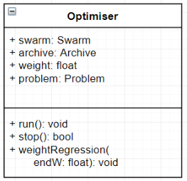

# Optimiser

___
## Attributes
* swarm: Swarm
The swarm is the object that stores the array of particles. 

* archive: Archive
The archive that is used to store non dominated solutions.

* weight: float
The weight variable is used for determining the level of inertia that all the particles have. This slowly adjusts to a lower number like simulated annealing.

* problem: Problem
The problem is the object that stores configuration settings and the objective function that the optimiser will use.

* iteration: int
Keeps the number of iterations that have run in the optimiser.
___
## Methods
* run(): void
The run method is used to keep all of the main code for running a MOPSO.

* stop(): Boolean
The stop method determines when the the optimiser will stop the next iteration. This returns false if the number of iterations has reached its max or the average velocity has reached its minimum indicating that the particles have stopped moving. 

* weightRegression(startW: float, endW: float): void
This method changes the weight variable. `Dicussions need to be had about the method.`