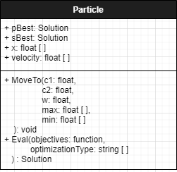

# Particle

___
## Attributes
* p_best: solution
This attribute keeps track of the dimension and objective the particle has found which is it's best solution. 

* s_best: solution
This attribute keeps track of the dimension and objective of the global guide of the particle. `IMPLEMENTATION NEEDS DISCUSSION.`

* x: float [ ]
This attribute keeps track of the current dimension space the particle is taking up.

* velocity: float [ ]
This attribute keeps track of the particles last velocity for inertia.

___
## Methods

* move(c1: float, c2: float, w: float, max: float[ ], min: float [ ]): void
The move method changes the classes x attribute, moving the particle in the dimension space.

* eval(objective: function): solution
The eval method takes the particles x attribute and evaluates it with the objective function. The objective function will return an array of objectives which will be used with the x attribute to create a new solution object which will be returned. 

