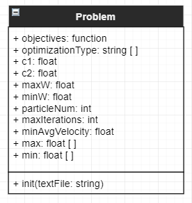

# Problem

___
## Attributes
* c1: float
The weight of the cognitive component of the particles move function.
* c2: float
The weight of the social component of the particles move function.
* maxW: float
The maximum value for the inertia weight.
* minW: float
The minimum value for the inertia weight.
* particleNum: int
Shows the number of particles that are going to be in the swarm.
* maxIterations: int
Specifies the number of iterations before the opimiser stops.
* minAvgVelocity: float
Specifies the minimum avg velocity of the particles before the optimiser stops.
* max: float [ ]
Specifies the maximum constraint for each of the dimensions.
* min: float [ ]
Specifies the minimum constraint for each of the dimensions.
___
## Methods
* init(textFile: String)
Opens the text file and reads the configuration info and populates it into the object.