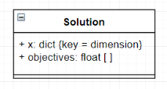

# Solution

___
## Attributes
* x: Dictionary
x is a dictionary of dimension variable values. By allowing it to be in a dictionary, a dimension can be indexed by its key name. `Will need to check if it's just as feasible with an array based on ZDT's implmentation. Array implmentation could improve performance.`

* objectives: float[ ]
objectives are a dictionary of floats that indicate a solutions performance in each objective.

* optimizationType: string[ ]
`optimizationType indicates how the user would like to optimize in each of the objectives. Can either be "MAX" or "MIN".`

___
## Methods
* isFullyDominated(Solution): Bool
`This method determines if the solution being inputed dominates the current solution. It does this by checking each of the objectives and there optimization type. `