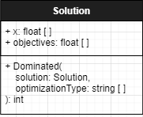

# Solution

___
## Attributes
* x: float [ ]
x is an array of dimension values.

* objectives: float[ ]
objectives are a dictionary of floats that indicate a solutions performance in each objective.
___
## Methods
* isFullyDominated(solution: Solution, optimizationType: string [ ]): Bool
`This method determines if the solution being inputed dominates the current solution. It does this by checking each of the objectives and there optimization type. `
