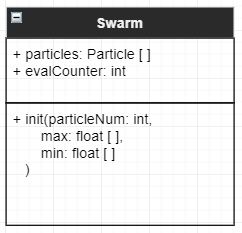

# Swarm

___
## Attributes
* particles: particle [ ]
This attribute keeps the array of particles used in the swarm.
* evalCounter: int
This keeps track of the amount of particles that have been evaluated. This will be more important when async programming is implemented. 
___
## Methods
* init(particleNum: int, max: float [ ], min: float [ ])
This method creates n particles with random starting positions in the constraints that are uniformly distributed.
